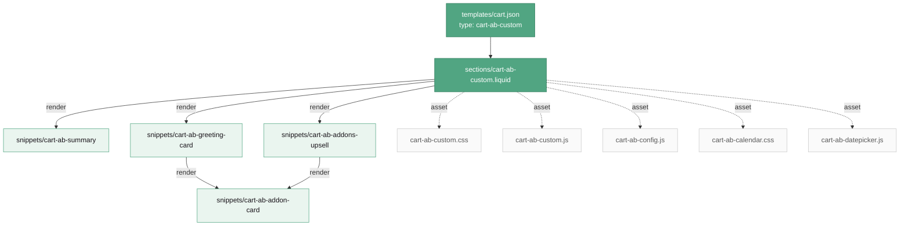
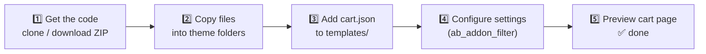

# 🛒 fc-cart-ab-custom

A modular, self-contained **custom Shopify cart** feature — a full delivery-date + timeslot picker, greeting-card selector, add-on upsells, and a live cart summary.

This repo contains **only** the custom cart code, cleanly renamed under a single `cart-ab-*` namespace so anyone can drop it into a Shopify theme and understand what each file does at a glance.

---

## 📦 What's inside

```
fc-cart-ab-custom/
├── sections/
│   └── cart-ab-custom.liquid        # 🧩 Entry point — the cart section (schema + layout)
├── snippets/
│   ├── cart-ab-summary.liquid        # 🧾 Cart line-items, totals, checkout button
│   ├── cart-ab-greeting-card.liquid  # 💌 "Choose your Message Card" step
│   ├── cart-ab-addons-upsell.liquid  # 🎁 "Finishing touch" add-on upsell + filter tabs
│   └── cart-ab-addon-card.liquid      # 🃏 Shared product card (used by greeting + upsell)
├── assets/
│   ├── cart-ab-custom.css            # 🎨 Main cart styles
│   ├── cart-ab-custom.js             # ⚙️ Main cart logic (qty, checkout, delivery, addons)
│   ├── cart-ab-config.js             # 🔧 Config / constants
│   ├── cart-ab-calendar.css          # 📅 Datepicker styles
│   └── cart-ab-datepicker.js         # 📆 Calendar + timeslot picker logic
└── templates/
    └── cart.json                     # 🔗 Wires the cart page to the section
```

---

## 🗺️ How the pieces fit together



---

## ✅ Prerequisites (must already exist in your theme)

This cart depends on a few theme-level things that live **outside** these 10 files. Set these up first or the cart will error/look broken:

| Dependency | What / Why | Required? |
|---|---|---|
| **`snippets/icon.liquid`** | The theme's icon renderer. The cart calls `` many times. | 🔴 Required |
| **`cart-*` icon SVGs** | Icons used: `cart-clear-x`, `cart-trash`, `cart-truck-2`, `cart-lock`, `cart-check`, `cart-plus`, `cart-arrow-left`, `cart-arrow-right`, `cart-chevron-left/right/down`, `cart-warning-triangle`, `cart-cal-prev`, `cart-cal-next`. | 🔴 Required |
| **Collection `greeting-cards`** | Products shown in the "Message Card" step. | 🔴 Required |
| **Collection `add-ons`** | Products shown in the add-on upsell step. | 🔴 Required |
| **`assets/fruit_basket.jpg`** | Empty-cart illustration. | 🟡 Optional |
| **`sections/ab-product-modal.liquid`** | Quick-view modal for the "i" button on product cards. | 🟡 Optional |
| **Theme settings** | `primary_color`, `free_shipping_*`, `trust_*`, `disable_delivery_*`, `timeslot_9to6_*`, `date_message*`, `custom_collection`, and **`ab_addon_filter`** (see below). | 🟠 See step 4 |

---

## 🚀 Installation — step by step



### 1️⃣ Get the code from GitHub

**Option A — Download ZIP (easiest):**
> On the GitHub repo page → green **`< > Code`** button → **Download ZIP** → unzip it.

**Option B — Clone:**
```bash
git clone https://github.com/abdurrakib528/fc-cart-ab-custom.git
```

### 2️⃣ Copy each file into the matching theme folder

Copy the files from this repo into the **same-named folders** of your Shopify theme (`Online Store → Themes → Edit code`, or your local theme folder):

| Copy this file… | …into your theme's |
|---|---|
| `sections/cart-ab-custom.liquid` | `sections/` |
| `snippets/cart-ab-summary.liquid` | `snippets/` |
| `snippets/cart-ab-greeting-card.liquid` | `snippets/` |
| `snippets/cart-ab-addons-upsell.liquid` | `snippets/` |
| `snippets/cart-ab-addon-card.liquid` | `snippets/` |
| `assets/cart-ab-custom.css` | `assets/` |
| `assets/cart-ab-custom.js` | `assets/` |
| `assets/cart-ab-config.js` | `assets/` |
| `assets/cart-ab-calendar.css` | `assets/` |
| `assets/cart-ab-datepicker.js` | `assets/` |

> 💡 In the Shopify code editor: open each folder → **Add a new asset/section/snippet** → name it exactly as above → paste the contents.

### 3️⃣ Wire up the cart template

Copy **`templates/cart.json`** into your theme's `templates/` folder. This tells Shopify to render the cart page with our section:

```json
{
  "sections": {
    "cart-ab": {
      "type": "cart-ab-custom"
    }
  },
  "order": [
    "cart-ab"
  ]
}
```

> ⚠️ The `"type"` value **must** match the section filename (`cart-ab-custom.liquid` → `"cart-ab-custom"`). If you rename the section, update this too.

### 4️⃣ Configure the add-on filter setting

The upsell step (`cart-ab-addons-upsell.liquid`) reads a theme setting called **`ab_addon_filter`** to build its category tabs. Each tab is a `Display Name = tag-handle` pair, comma-separated:

```
All = all, Chocolates = chocaddon, Balloons = baladdon, Cookies = cookaddon, Plush = plushaddon, Drinks = drinksaddon, Others = otheraddon, Selected Items = selected
```

- **Left of `=`** → the label shown on the tab.
- **Right of `=`** → a product **tag handle** on products in your `add-ons` collection. A product appears under a tab when it carries that tag.

**To make it editable in the Theme Customizer**, add this block to your theme's `config/settings_schema.json` (inside any settings group's `settings` array):

```json
{
  "type": "text",
  "id": "ab_addon_filter",
  "label": "Add-on filter tabs",
  "info": "Format: Label = tag-handle, comma-separated. e.g. Chocolates = chocaddon",
  "default": "All = all, Chocolates = chocaddon, Balloons = baladdon, Others = otheraddon"
}
```

> Without this setting, the add-on tabs simply won't render — the products still show under one list.

### 5️⃣ Preview

Open your store's **Cart page** (`/cart`). You should see the full custom cart. 🎉
If icons are missing, revisit the **Prerequisites** table (the `icon` snippet + `cart-*` SVGs).

---

## 🧹 Old files to remove (legacy v1 cart)

If you're migrating an existing theme that had the old `ab-` cart, delete these **dead/legacy** files after installing the new one:

```
sections/ab-cart-section.liquid
sections/ab-cart-template-v1.liquid
assets/ab-cart-section.css
assets/ab-cart-section.js
assets/ab-cart-config.js
assets/ab-calendar.css
assets/ab-datepicker.js
assets/ab-cart.css
assets/ab-cart.js
snippets/ab-cart-summary.liquid
snippets/ab-product-greeting-card.liquid
snippets/ab-last-chance-addons.liquid
snippets/ab-product-addon-card.liquid
snippets/ab-cart-item-list.liquid
snippets/ab-datepicker.liquid
snippets/ab-product-addons.liquid
snippets/ab-product-addons-card.liquid
templates/cart.old.liquid
```

> The first 13 are the **old versions of the files in this repo** (replaced by their `cart-ab-*` equivalents). The rest are **unused v1 leftovers** with no references anywhere.

---

## 🔤 Rename reference (old → new)

| Old name | New name |
|---|---|
| `sections/ab-cart-section.liquid` | `sections/cart-ab-custom.liquid` |
| `assets/ab-cart-section.css` | `assets/cart-ab-custom.css` |
| `assets/ab-cart-section.js` | `assets/cart-ab-custom.js` |
| `assets/ab-cart-config.js` | `assets/cart-ab-config.js` |
| `assets/ab-calendar.css` | `assets/cart-ab-calendar.css` |
| `assets/ab-datepicker.js` | `assets/cart-ab-datepicker.js` |
| `snippets/ab-cart-summary.liquid` | `snippets/cart-ab-summary.liquid` |
| `snippets/ab-product-greeting-card.liquid` | `snippets/cart-ab-greeting-card.liquid` |
| `snippets/ab-last-chance-addons.liquid` | `snippets/cart-ab-addons-upsell.liquid` |
| `snippets/ab-product-addon-card.liquid` | `snippets/cart-ab-addon-card.liquid` |

> **Note:** Internal CSS class names and JS variables still use the `ab-` prefix (e.g. `.ab-cart__item`). These are cosmetic and were intentionally left unchanged so functionality is 100% identical. They can be renamed in a future pass if desired.
